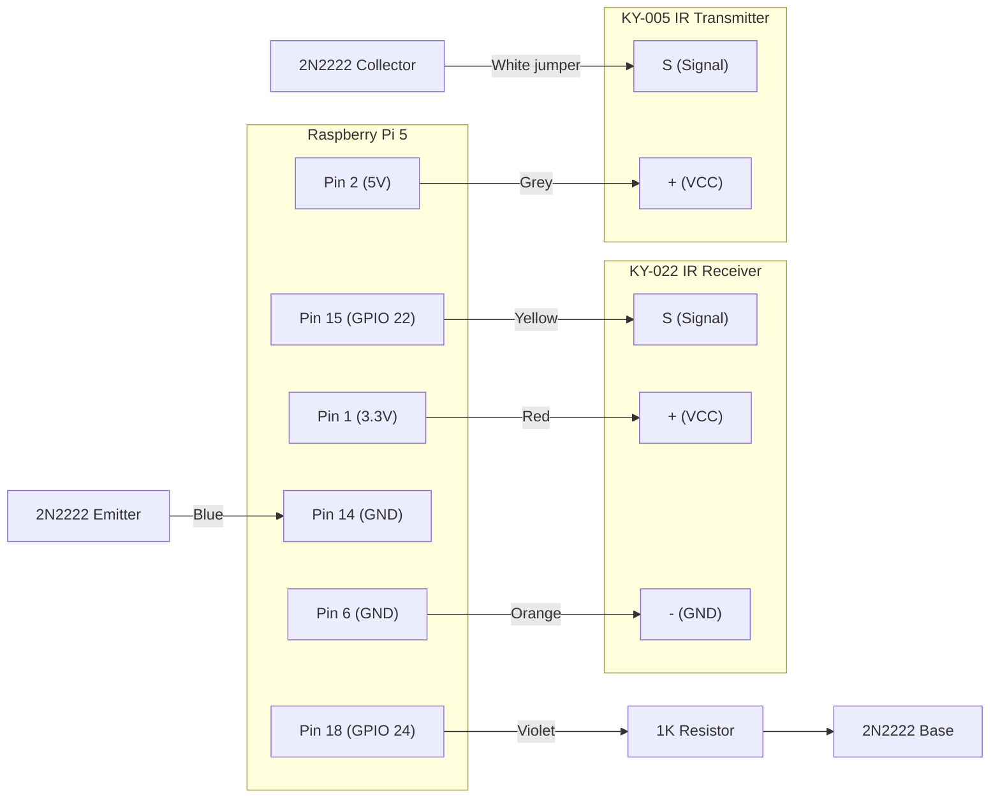

# Clawdia Wiring Log

**Date:** 2026-03-28

## Breadboard Layout

Mini breadboard, columns A-J, rows 1-17. A-E connected per row, F-J connected per row.

## KY-022 IR Receiver (rows 1-3)

| Row | Module Pin |
|-----|-----------|
| A1  | - (GND)   |
| A2  | + (VCC)   |
| A3  | S (Signal)|

Wiring to Pi:
- **D2** → Red wire → **Pi Pin 1** (3.3V)
- **D1** → Orange wire → **Pi Pin 6** (GND)
- **D3** → Yellow wire → **Pi Pin 15** (GPIO 22)

## 2N2222 Transistor (rows 7-9, flat side facing forward)

| Row | Leg       |
|-----|-----------|
| A7  | Emitter   |
| A8  | Base      |
| A9  | Collector |

## 1K Resistor

- **E8** (Base row) to **E11**

## KY-005 IR Transmitter (rows 15-17)

| Row | Module Pin      |
|-----|-----------------|
| A15 | - (GND, unconnected) |
| A16 | + (VCC)         |
| A17 | S (Signal)      |

## Transmitter wiring

- **White jumper**: D9 → D17 (Collector to KY-005 Signal)
- **Violet wire**: D11 → **Pi Pin 18** (GPIO 24, through resistor to Base)
- **Blue wire**: D7 → **Pi Pin 14** (GND, Emitter)
- **Grey wire**: D16 → **Pi Pin 2** (5V, KY-005 VCC)

## Summary of Pi GPIO pins used

| Pi Pin | Function   | Wire Color | Goes To            |
|--------|-----------|------------|-------------------|
| Pin 1  | 3.3V      | Red        | KY-022 + (VCC)    |
| Pin 2  | 5V        | Grey       | KY-005 + (VCC)    |
| Pin 6  | GND       | Orange     | KY-022 - (GND)    |
| Pin 14 | GND       | Blue       | Transistor Emitter |
| Pin 15 | GPIO 22   | Yellow     | KY-022 S (IR Rx)  |
| Pin 18 | GPIO 24   | Violet     | Resistor → Base (IR Tx) |

## Device Verification (2026-03-28)

After reboot, both IR devices detected:
- `/dev/lirc0` = GPIO IR Transmitter (GPIO 24)
- `/dev/lirc1` = GPIO IR Receiver (GPIO 22)

Kernel log confirms:
```
rc rc2: GPIO IR Bit Banging Transmitter as gpio-ir-transmitter@18, lirc minor=0
rc rc3: gpio_ir_recv registered at minor=1, raw IR receiver
```

## ReSpeaker HAT — DROPPED

The Keyestudio ReSpeaker 2-Mic HAT covers all 40 GPIO pins with no pass-through headers. IR transmitter (GPIO 24) and receiver (GPIO 22) are wired underneath — can't mount the HAT without losing them. Soldering a stacking header is not practical.

**Decision:** Use USB audio instead. The ADELGO USB SoundBar speaker was already purchased — check if it has a built-in mic. If not, get a cheap USB mic. Docker config uses USB audio device paths instead of I2S /dev/snd.

## USB Speaker Verified (2026-03-28)

- VOTNTUT EL 001 / ADELGO USB Soundbar detected as Card 3: UACDemoV1.0 (Jieli Technology)
- Playback tested with `speaker-test` — working
- No built-in microphone — separate USB mic ordered
- Initial undervoltage warning resolved by switching to proper 5V/3A+ PSU

## Telegram + Brain Verified (2026-03-28)

End-to-end pipeline confirmed working:
- Telegram bot receives messages and responds
- Brain routes to OpenRouter → Claude Haiku 4.5 → structured response
- Orchestrator correctly routes IR commands vs text responses
- IR controller reports missing code files (correct behaviour pre-recording)
- Error handling works (brain failures return friendly message)

Test messages:
- "so how is the weather in vienna?" → text response from LLM (working)
- "turn off the TV" → routed to IR → "IR command 'power' not available. Record it first." (correct)

## What Is NOT Yet Verified

- IR receiver capturing remote signals (needs to be at the TV)
- IR transmitter controlling the TV (needs to be at the TV)
- Voice pipeline (USB conference mic on order)
- Docker deployment (ran directly with Python so far)
- Piper TTS output through USB speaker

## Next Steps

1. Move setup near TV
2. Test receiver — point TV remote at KY-022 and run:
   ```bash
   ir-ctl -d /dev/lirc1 -r --one-shot
   ```
3. Record IR codes for each TV button:
   ```bash
   ir-ctl -d /dev/lirc1 -r --one-shot > ~/ir-codes/power.txt
   ir-ctl -d /dev/lirc1 -r --one-shot > ~/ir-codes/vol_up.txt
   ir-ctl -d /dev/lirc1 -r --one-shot > ~/ir-codes/vol_down.txt
   ir-ctl -d /dev/lirc1 -r --one-shot > ~/ir-codes/mute.txt
   ```
4. Test transmitter — play back a recorded code:
   ```bash
   ir-ctl -d /dev/lirc0 --send=~/ir-codes/power.txt
   ```
5. Point KY-005 at TV and verify it responds
6. Set up Telegram bot (talk to @BotFather)
7. Get OpenRouter + OpenAI API keys
8. Fill in `.env` and deploy with `docker compose up --build`

## Wiring Diagram


